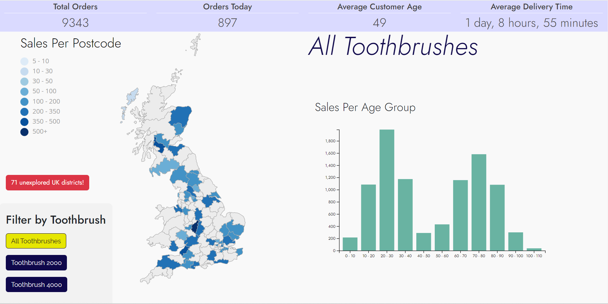
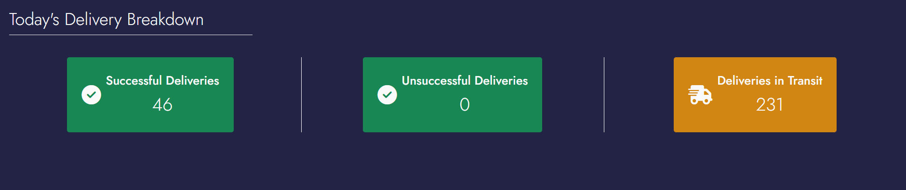
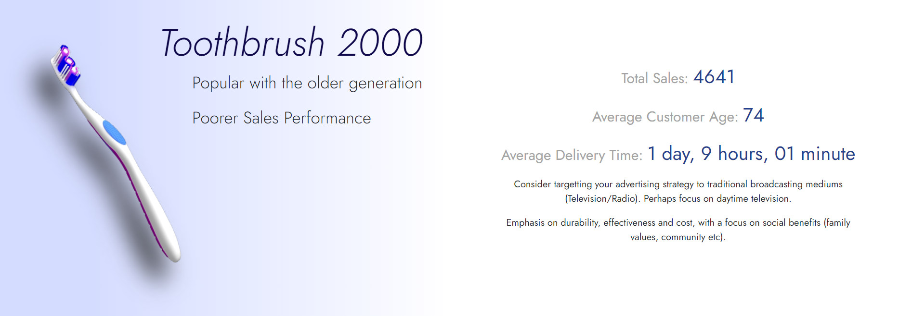
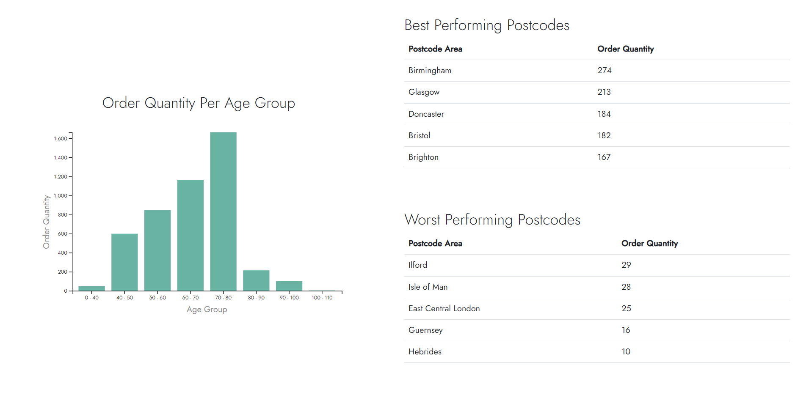

# Xander Toothbrush Data Project - Frontend

[Check out the website here](http://xander-tb-frontend.s3.us-east-2.amazonaws.com/index.html)

A front-end to display mock Toothbrush Data, made with raw JavaScript, HTML and CSS.

## Features

The top-level of the web page features metadata regarding toothbrush sales, as well as customer demographics and locations.

Data is filterable by Toothbrush Type.

### Chloropleth

Sales-by-postcode data is represented using an interactive chloropleth map, allowing the user to hover over an individual postcode area
to inspect fine-grain order data, including:

- Total Sales
- Total Toothbrush 2000 Sales
- Total Toothbrush 4000 Sales
- Average Delivery Time

### Sales-by-age Bar Chart

An interactive bar chart is included to represent toothbrush sales by age group (1-10, 10-20, 20-30 etc).

A user can hover over each individual bar to inspect the exact amount of sales per age group.

### Delivery Statuses

A banner is also present, displaying the delivery status of the latest batch of toothbrush orders placed. These are color coded to represent
successful, unsuccessful or in-transit statuses.

### Individual Toothbrush Insights (Overall)

High-level data for each toothbrush is displayed, along with strategical advice dependent on the order status of the given toothbrush.

A bar chart is present to inform the user of the given toothbrush sales per age-group.

## Technologies Used
- [HTML5](https://en.wikipedia.org/wiki/HTML5) - HTML5 Markdown was used to create the content.
- [CSS3](https://en.wikipedia.org/wiki/CSS) - CC3 used to style HTML markdown.
- [D3 JS](https://d3js.org/) - The D3 JavaScript library was utilised to create the chloropleth and bar charts.
- [jQuery](https://jquery.com/) - jQuery was used for DOM manipulation.

## Deployment

- This website is deployed on an Amazon S3 Bucket.
